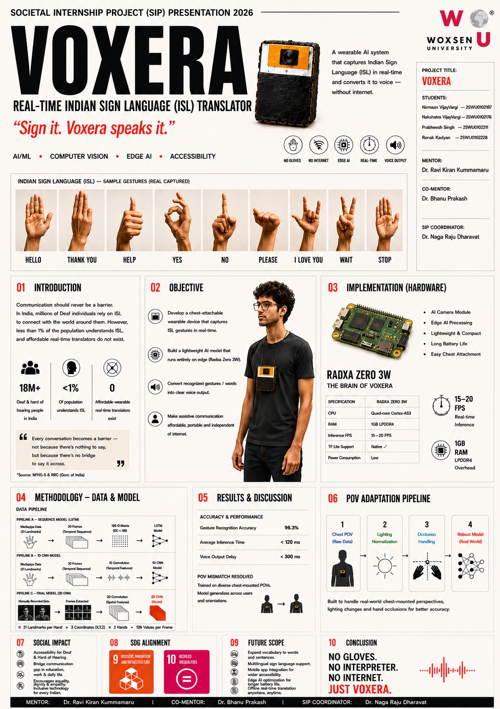
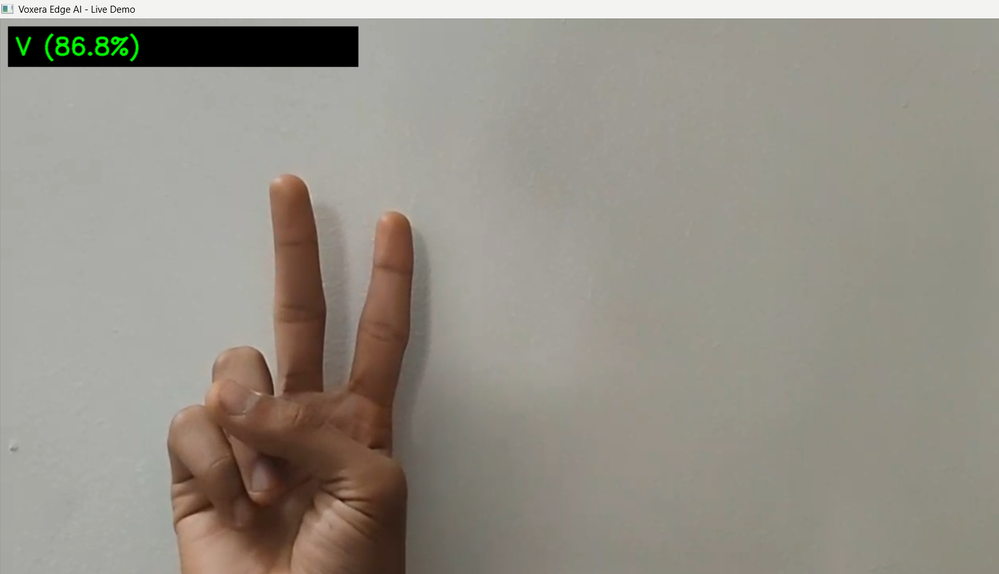
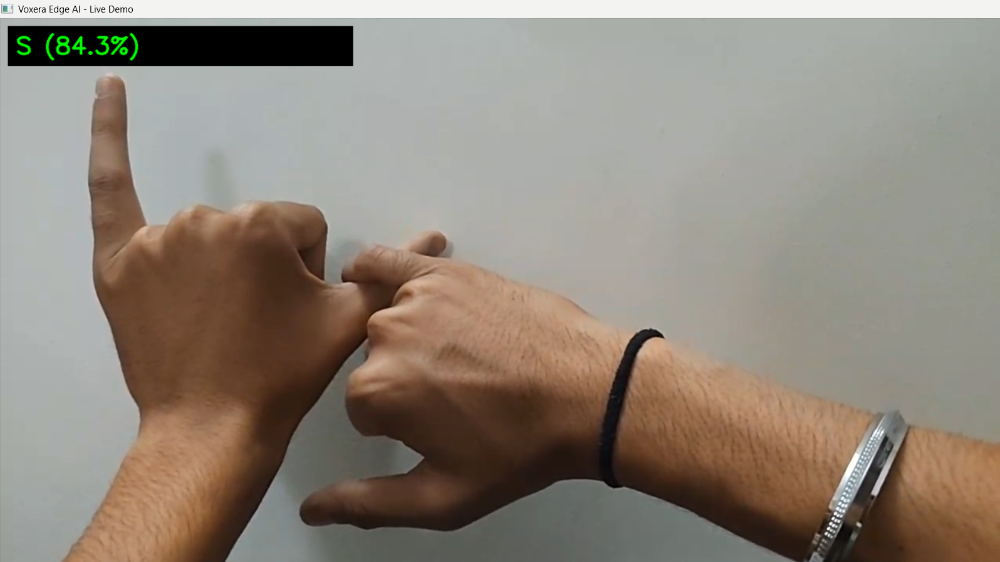
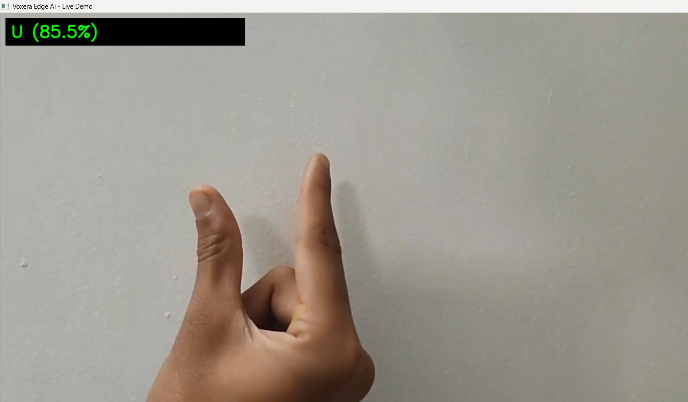
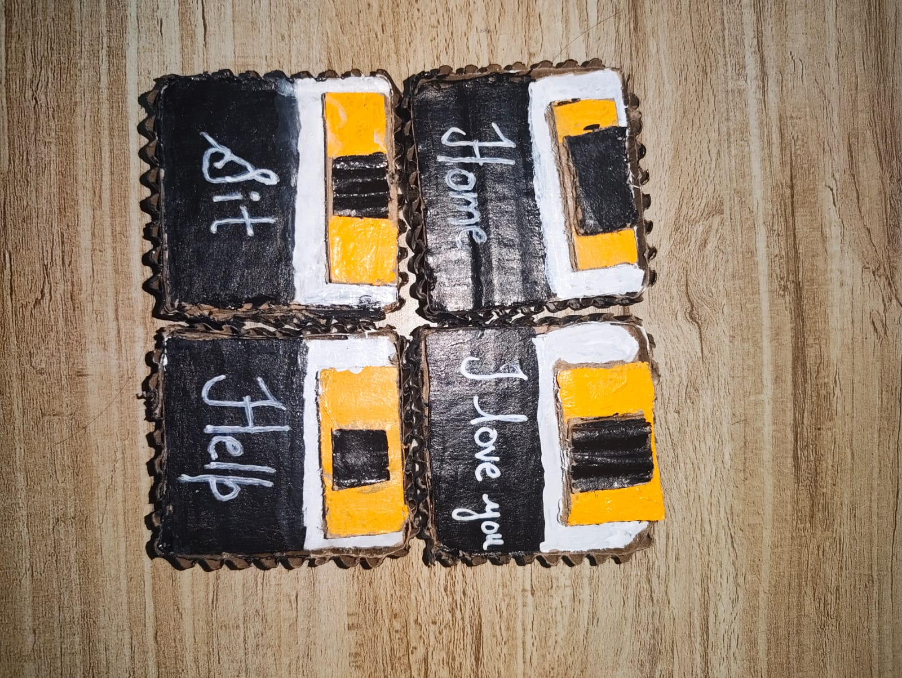
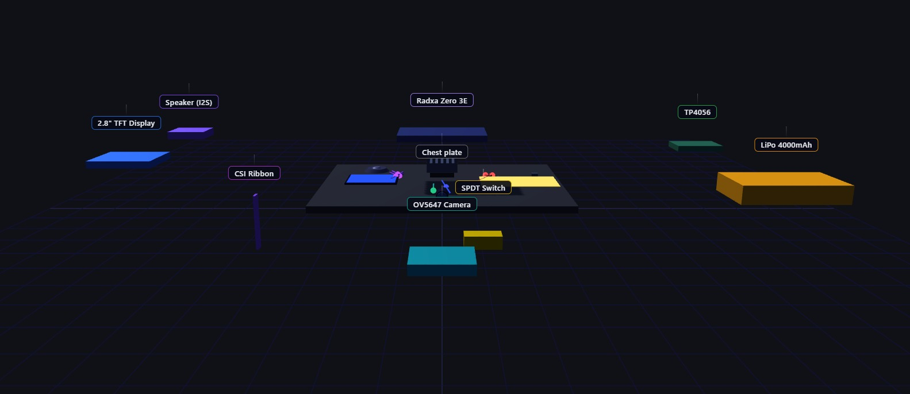
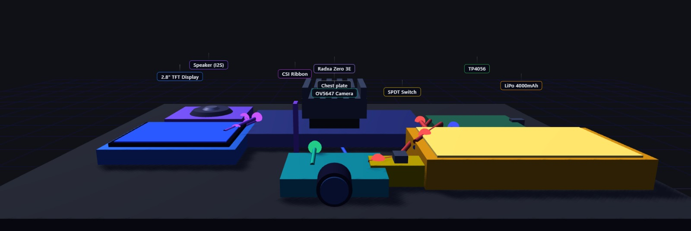

<p align="center">
  
</p>

# VOXERA

### Sign it. VoxEra speaks it.

### Real-Time Indian Sign Language (ISL) Translator using Edge AI & Computer Vision

A wearable AI-powered communication system that captures Indian Sign Language (ISL) gestures and converts them into speech in real time — entirely offline.

---


## Quick Navigation

- [Overview](#overview)
- [Demo Gallery](#demo-gallery)
- [Why VoxEra](#why-voxera)
- [Key Features](#key-features)
- [Hardware Architecture](#hardware-architecture)
- [Dataset Engineering](#dataset-engineering)
- [Performance](#performance)
- [Installation](#installation)
- [Team](#team)


---

# 🌐 Project Resources

### Dataset

The VoxEra dataset has been publicly released on Kaggle to support research and development in Indian Sign Language recognition.

📊 **Kaggle Dataset:**  
https://www.kaggle.com/datasets/prabheeshsingh/isl-letters-a-to-z-and-numbers-1-9

The dataset contains Indian Sign Language alphabets, digits, and deployment-oriented samples collected under multiple environmental conditions to improve real-world robustness.

---

### Project Journey

Follow the story behind VoxEra's development, from ideation and whiteboard discussions to a functional wearable AI prototype.

🔗 **LinkedIn Project Post:**  
https://www.linkedin.com/posts/nirmaanvijayvargi_four-people-one-whiteboard-and-a-problem-ugcPost-7462403827514626048-Cjsc/

---

### Open Source Repository

💻 **GitHub Repository:**  
https://github.com/Nirmaanvijayvargi/VoxEra

---


## Overview

VoxEra is a wearable AI-powered communication system designed to bridge the communication gap between Indian Sign Language (ISL) users and individuals who do not understand sign language.

The project combines Computer Vision, Deep Learning, Edge AI, and Wearable Computing to perform real-time sign-to-speech translation entirely offline.

Unlike conventional sign language recognition systems that rely on cloud infrastructure, stationary cameras, or interpreter support, VoxEra is designed as a self-contained chest-mounted wearable capable of recognizing gestures from a first-person perspective and generating understandable spoken output.

---

## Demo Gallery

### Gesture Recognition – V



### Gesture Recognition – S



### Gesture Recognition – U



---

## Wearable Prototype




---

## Why VoxEra?

Communication should never be a barrier.

Millions of Deaf and Hard-of-Hearing individuals rely on Indian Sign Language (ISL) as their primary mode of communication. However, interpreter availability remains limited, creating communication challenges in education, healthcare, workplaces, public services, and daily interactions.

Most existing solutions suffer from:

- Internet dependency
- Stationary camera setups
- Cloud processing requirements
- Limited portability
- Third-person viewpoints

VoxEra addresses these limitations through wearable, offline, real-time AI.

| Traditional Systems | VoxEra |
|--------------------|---------|
| Fixed Camera | Wearable |
| Cloud Processing | On Device |
| Internet Required | Offline |
| Third Person View | First Person POV |
| Stationary Setup | Portable |
| External Infrastructure | Self-Contained |


---

## Key Features

- Real-Time ISL Recognition
- Offline Edge AI Inference
- Wearable Form Factor
- Text-to-Speech Output
- Egocentric Vision Pipeline
- Custom ISL Dataset
- Background Robustness
- Lightweight Deployment
- No Internet Required
- Portable & Affordable


---

# Hardware Architecture

## Hardware Components

| Component | Purpose |
|------------|----------|
| Radxa Zero 3W | Edge AI Processing |
| OV5647 Camera | Gesture Capture |
| TFT Display | Visual Output |
| Speaker Module | Voice Output |
| LiPo Battery | Portable Power |
| TP4056 Module | Charging System |
| Chest Mount | Wearable Deployment |

## Hardware Design

### Exploded View



### Compact Assembly




# Dataset Engineering

One of the biggest challenges in sign language recognition is ensuring that a model performs reliably in real-world deployment conditions rather than only in controlled laboratory environments.

Since VoxEra is designed as a chest-mounted wearable system, we adopted a deployment-first dataset engineering strategy.

> "Train the model on the conditions in which it will actually be used."

Instead of collecting data solely under ideal conditions, we intentionally introduced environmental variability during data collection to improve robustness before model training even began.

## Supported Classes

### Alphabets
A–Z (26 Classes)

### Digits
0–9 (10 Classes)

### Common ISL Words

- I Love You
- Home
- Help
- Sit
- Stand

### Total Classes

41 Classes

---

## Environmental Data Collection Strategy

For every gesture class, data was collected under five different environmental conditions.

### Normal Background
Baseline samples with clear visibility and minimal distractions.

### Low Brightness
Simulated dim indoor and low-light environments.

### Static Object Background
Included furniture, bags, and other objects to introduce visual clutter.

### Moving Background
Included people and moving objects to simulate dynamic environments.

### Chest-Mounted POV
Captured from the same perspective intended for wearable deployment.

This was the most important condition because traditional sign language datasets are usually recorded from a frontal camera perspective, while VoxEra is designed to operate from a first-person chest-mounted viewpoint.

By collecting deployment-oriented data from the beginning, VoxEra improves robustness, generalization, and real-world usability.


# AI Pipeline & Model Development

VoxEra was designed with future Edge AI deployment in mind.

The objective was:

- No Internet
- No Cloud Processing
- No External Servers

All processing should occur directly on the wearable device.

---

## Computer Vision Pipeline

### Step 1 — Video Capture

The camera records sign language gestures in real time.

### Step 2 — Frame Processing

OpenCV handles:

- Video stream processing
- Frame extraction
- Basic image preprocessing

### Step 3 — Hand Detection

MediaPipe is used for real-time hand tracking and landmark detection.

MediaPipe was selected because of its:

- Speed
- Accuracy
- Lightweight deployment
- Real-time performance

### Step 4 — Landmark Extraction

MediaPipe extracts 21 hand landmarks.

Each landmark contains:

- X Coordinate
- Y Coordinate
- Z Coordinate

Result:

21 Landmarks × 3 Coordinates = 63 Features

These landmark coordinates become the feature representation used by the model.

---

## Why Landmarks Instead of Raw Images?

Using raw images would require:

- Larger datasets
- Larger models
- More memory
- Higher computational cost

For a wearable Edge AI device, efficiency is critical.

Landmarks provide:

- Lower dimensionality
- Faster inference
- Better portability
- Reduced computational overhead

---

## Model Selection

### One-Dimensional Convolutional Neural Network (1D CNN)

Instead of processing raw image pixels, VoxEra uses landmark coordinate vectors generated by MediaPipe.

A 1D CNN was chosen because it can:

- Learn local landmark relationships
- Capture spatial hand structures
- Maintain computational efficiency
- Enable lightweight deployment

### Advantages

- Smaller Model Size
- Faster Inference
- Edge-Device Compatibility
- Lower Computational Cost

---

## Real-Time Inference Pipeline

User Performs Sign
↓
Camera Captures Gesture
↓
OpenCV Processes Frame
↓
MediaPipe Extracts Landmarks
↓
63-Feature Vector Generated
↓
1D CNN Classification
↓
Predicted Character / Digit / Word
↓
Text Output Displayed
↓
Future Text-to-Speech Output

---

## Results

### Recognition Accuracy

**96.3%**

The combination of deployment-oriented dataset engineering, landmark-based feature extraction, and 1D CNN classification enabled accurate and efficient recognition of ISL gestures while maintaining compatibility with future wearable Edge AI deployment.


---

# Performance & Results

The trained 1D CNN model achieved strong performance while maintaining compatibility with future Edge AI deployment.

| Metric | Result |
|----------|----------|
| Recognition Accuracy | 96.3% |
| Total Classes | 41 |
| Feature Representation | 63 Landmark Features |
| Model Type | 1D CNN |
| Inference Mode | Real-Time |
| Connectivity Requirement | None |
| Processing Mode | On-Device / Edge AI |

---

## Key Engineering Takeaways

Throughout the development of VoxEra, several important engineering principles became clear:

1. Dataset quality often contributes more to performance than model complexity.

2. Training data should reflect deployment conditions.

3. Feature engineering can significantly reduce computational requirements.

4. Edge AI systems require different design decisions compared to cloud-based AI systems.

5. Real-world robustness must be considered during data collection, not after deployment.

6. Accessibility technology requires both technical performance and practical usability.


---

# Future Roadmap

The current prototype represents the first step toward a complete wearable ISL communication assistant.

Future versions aim to support:

- Larger ISL vocabularies
- Continuous sentence recognition
- Text-to-Speech generation
- Multilingual output
- Lightweight wearable hardware
- Full offline operation
- Mobile application integration
- Bidirectional communication systems

---

# Long-Term Vision

The long-term goal of VoxEra is to create an intelligent communication companion that enables seamless interaction between ISL users and the wider world.

By combining Artificial Intelligence, Computer Vision, and Wearable Computing, VoxEra aims to reduce communication barriers and improve accessibility in education, healthcare, workplaces, and everyday life.


---

# Repository Structure

```text
VoxEra/
│
├── README.md
├── train2.py
├── webcam.py
│
├── assets/
│   ├── poster.jpeg
│   ├── prototype.jpg
│   ├── demo_v.png
│   ├── demo_s.png
│   ├── demo_u.png
│   ├── hardware_with_labels.jpg
│   └── hardware_collapsed.jpg
│
├── docs/
│
├── models/
│
└── requirements.txt
```


---

# Installation

## Clone Repository

```bash
git clone https://github.com/Nirmaanvijayvargi/VoxEra.git
cd VoxEra
```

## Install Dependencies

```bash
pip install -r requirements.txt
```

## Run Live Inference

```bash
python webcam.py
```

## Train Model

```bash
python train2.py
```


---

# Team

### Nirmaan Vijay Vargi
Systems Architecture • Dataset Engineering • Development

### Nakshatra Vijay Vargi
Hardware Design • Data Collection • Integration

### Prabheesh Singh
Machine Learning • Model Development

### Ronak Kadyan
Research • Documentation • Testing


---

# Mentors

### Dr. Ravi Kiran Kummamaru
Project Mentor

### Dr. Bhanu Prakash
Co-Mentor


---

<div align="center">

## NO GLOVES.

## NO INTERPRETER.

## NO INTERNET.

# JUST VOXERA.

</div>

